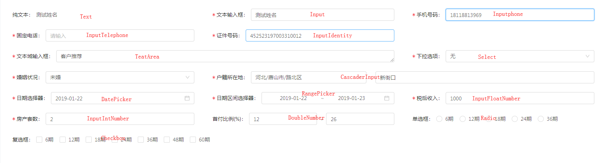

## 公共动态表单说明

* 单个表单数据返回结构

```js
item = {
    validateType: {
        notNull: true, // 是否必填
        canEdit: true, // 是否可编辑
    },
    formType: "Text", // 表单类型
    fieldName: "客户姓名", // 表单 label
    name: "customerName", // 字段 name
    width: 1, // 栅格化3栏，占几栏
    fieldValue: "1559", // 表单 value
    fieldCodes: [], // Select/Cascader/CascaderInput/SelectVehicle 显示 code
    dictList: [], // 下拉选项
}
```

* formType 取值

```
PlainText 纯文本 -> 字段无需提交

Text 纯文本 -> 字段可提交

TextArea 文本域输入

Input 文本输入框

InputPhone 手机号码输入框

InputTelephone 固定电话输入框

InputIdentity 身份证输入框

InputIntNumber 整数输入框

InputFloatNumber 可输入小数输入框

InputNumber 数字输入框

DoubleNumber 比例区间输入框 -> 整数

FloatDoubleNumber 比例区间输入框 -> 浮点数

TextInputNumber 文本及数字输入组

Select 下拉框

CascaderSelect 级联下拉框 (接口返回树状下拉选项)

Cascader 城市选择器

CascaderInput 地区加详情选择输入

Radio 单选

Checkbox 多选

SelectVehicle 车型信息

DatePicker 日期选择器

LongTermPicker 日期选择器(配置长期) -> 证件截止日期

RangePicker 区间选择器

LongRangePicker 区间选择器(配置长期) -> 证件有效期

CustomerButton 客户姓名

SalesmanButton 业务员姓名

DealerButton 车商名称
```



* fieldValue 输入框/下拉框/城市选择器/车型选择器 中文字段

* fieldCodes 下拉框/城市选择器/车型选择器 code 码 --- 数组类型
